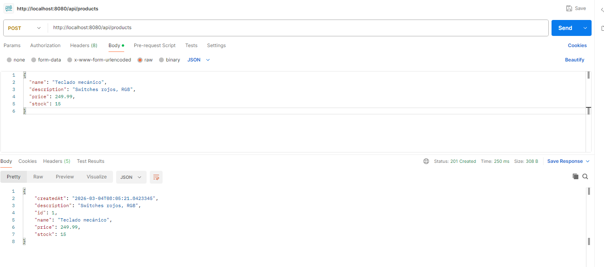
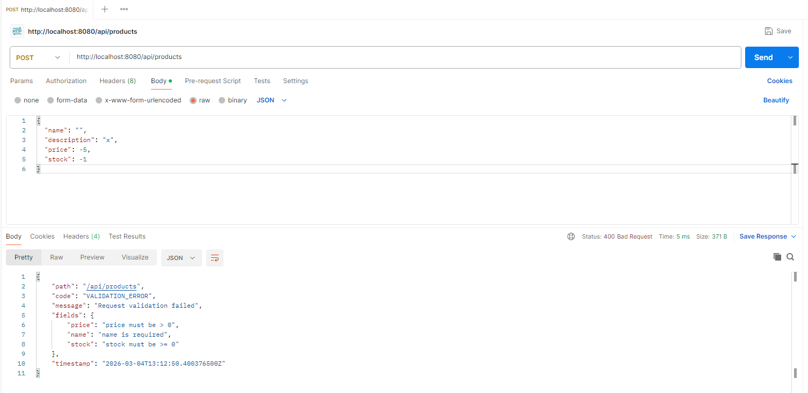
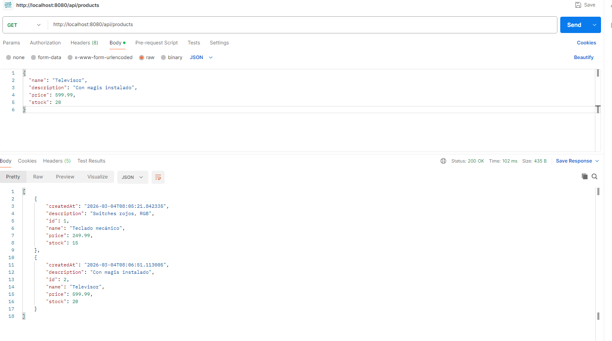
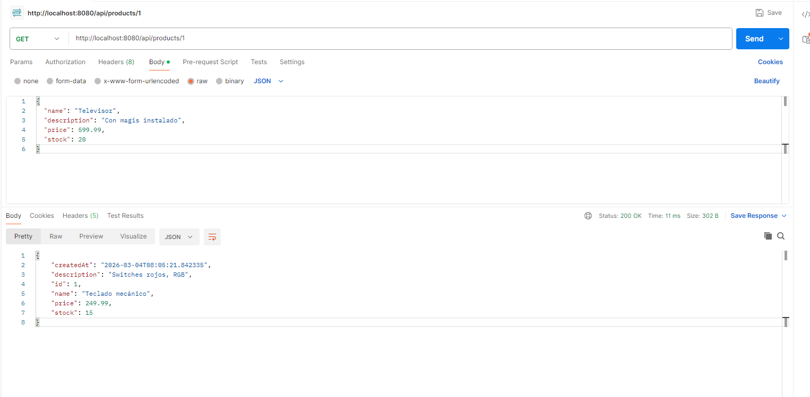
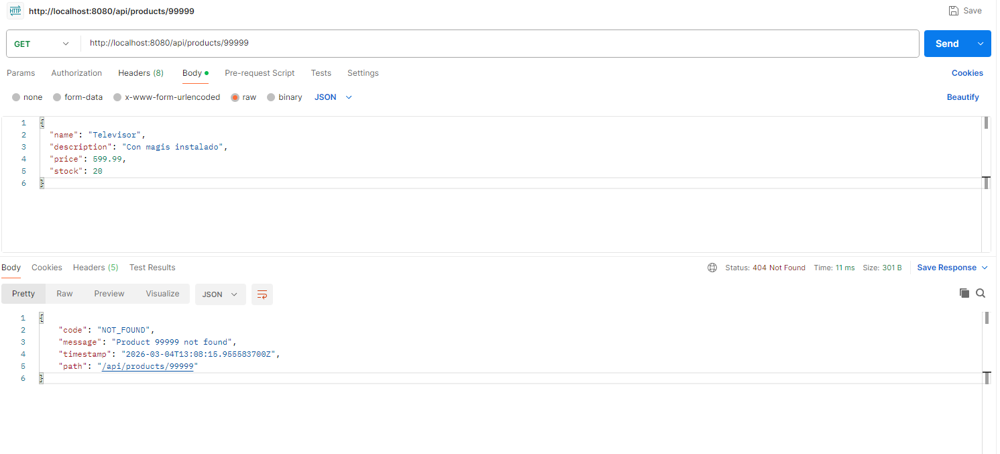
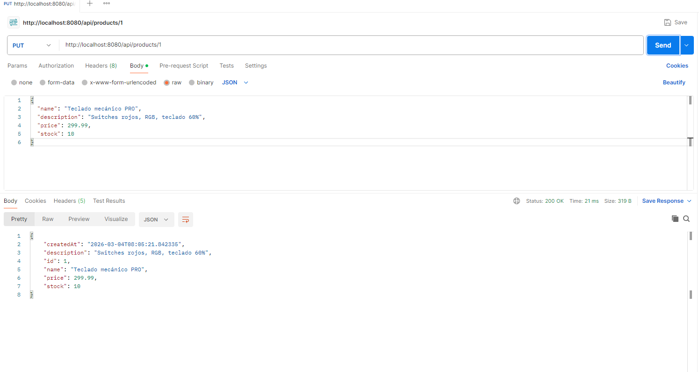
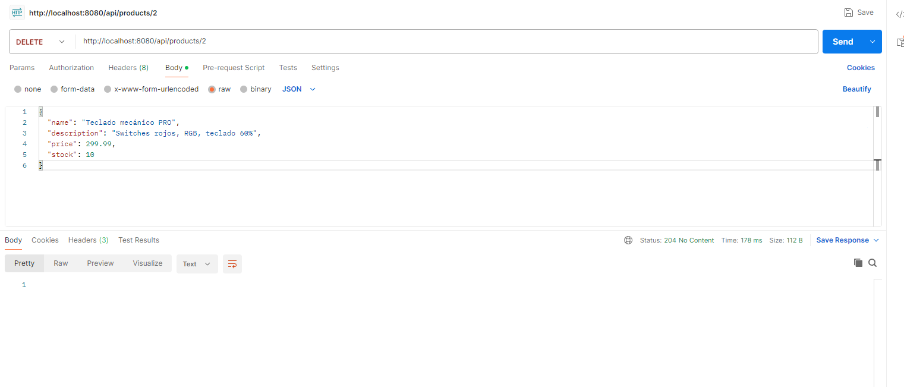
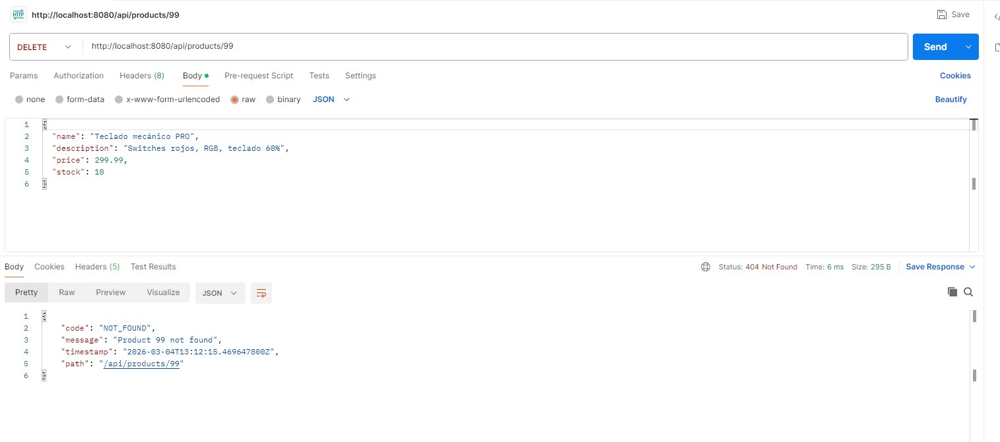

# EPW — Products API (Spring Boot + PostgreSQL)

API REST de **productos** (CRUD) hecha siguiendo el mismo paso a paso del profe con el ejemplo de **Activities**, pero adaptada a `com.epw.products` y solo con lo que aplica para Products.

---

## Qué se entregó

- CRUD completo:
  - `POST /api/products`
  - `GET /api/products`
  - `GET /api/products/{id}`
  - `PUT /api/products/{id}`
  - `DELETE /api/products/{id}`
- DTOs para request/response + `@Valid`
- Manejo global de respuestas de error (404 y validaciones) con `GlobalExceptionHandler`
- Persistencia con JPA + PostgreSQL

---

## Arquitectura 

Paquete base: `com.epw.products`

- **entity**: `Product` (JPA)
- **repository**: `ProductRepository`
- **service**: `ProductService` (interfaz)
- **service.impl**: `ProductServiceImpl` (lógica + mapper `toResponse`)
- **controller**: `ProductController` (endpoints)
- **dto**: `CreateProductRequest`, `UpdateProductRequest`, `ProductResponse`
- **exception**: `ResourceNotFoundException`, `ApiError`, `GlobalExceptionHandler`

---

## Modelo `Product`

Campos:
- `id`
- `name`
- `description`
- `price`
- `stock`
- `createdAt` (**LocalDateTime**, se asigna automático con `@PrePersist`)

---

## Evidencia en Postman 

> Carpeta: `screenshots/`

### 1) Crear producto — `POST /api/products`
Se crea un producto y la respuesta devuelve el `id` y `createdAt`.

### 2) Crear producto (validación) — `POST /api/products`
Ejemplo de request inválido (campos requeridos / valores inválidos). Se devuelve 400 con detalle por campo.

### 3) Listar productos — `GET /api/products`
Lista de productos registrados en la BD.

### 4) Consultar por id — `GET /api/products/{id}`
Consulta del producto específico (ej. id = 1).

### 5) Consultar por id (no existe) — `GET /api/products/{id}`
Cuando el id no existe se devuelve 404 con respuesta controlada por el handler.

### 6) Actualizar — `PUT /api/products/{id}`
Actualización del producto (ej. cambio de precio para id = 1).

### 7) Eliminar — `DELETE /api/products/{id}`
Eliminación correcta (204 No Content).

### 8) Eliminar (no existe) — `DELETE /api/products/{id}`
Cuando el id no existe se devuelve 404 controlado.

---

## Autor
Kevin Rivera
